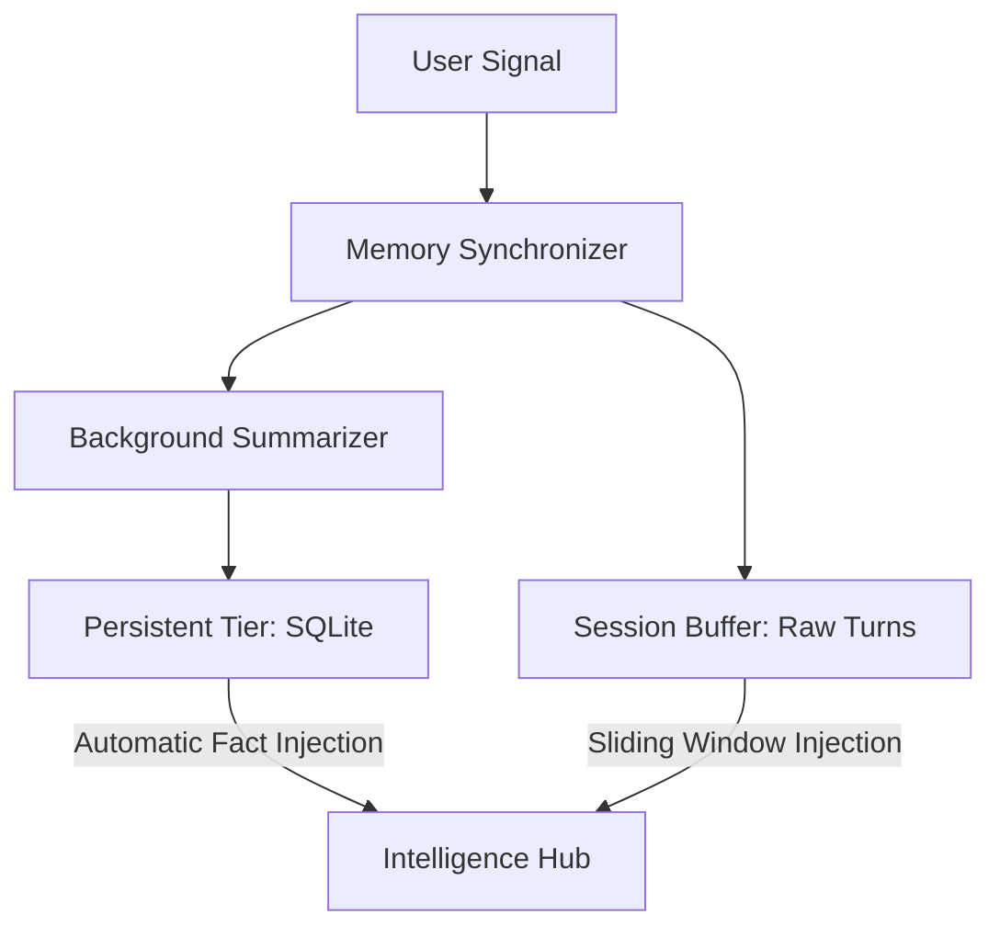

# OrionAI
### The Sovereign Multi-Agent Orchestration Framework

<div align="center">

**A minimalistic yet industrially robust framework. Precision-engineered for memory persistence, logic validation, and autonomous self-correction.**

[](https://pypi.org/project/orionagent/)
[](https://www.python.org/downloads/)
[](https://opensource.org/licenses/MIT)

---

[Quick Start](#quick-start) &nbsp;&bull;&nbsp; [Core Configuration](#core-configuration--api-reference) &nbsp;&bull;&nbsp; [Architecture](#architecture-blueprints) &nbsp;&bull;&nbsp; [Memory Tier](#memory-architecture--patterns) &nbsp;&bull;&nbsp; [OrionAI vs Others](#orionagent-vs-langchain--autogen)

---

</div>

## Philosophy

OrionAI is designed to eliminate the **black box** complexity of modern agent frameworks. It provides a low-abstraction, high-control environment for building agents that are **token-efficient**, **persistent by default**, and **deterministic** via logic guards.

---

## Quick Start

### Single Agent Integration
The `Agent` class provides a high-performance worker unit with integrated persistence and tool access.

```python
from orionagent import Agent, Gemini, tool

@tool
def crypto_ticker(symbol: str):
    """Fetches real-time prices for crypto assets."""
    return f"Current {symbol} Price: $65,000"

agent = Agent(
    name="Vanguard",
    role="Research Analyst",
    model=Gemini("gemini-2.0-flash"),
    memory="persistent",         # Automatic SQLite Knowledge Storage
    use_default_tools=True,      # Integrated Web, File, and OS tools
    tools=[crypto_ticker],
    guards=["straight", "short"], # Deterministic Output Validation
    verbose=True                 # Premium Dimmed Trace Logs
)

agent.chat("Analyze the current BTC trend.")
```

### Multi-Agent Orchestration
The `Manager` coordinates specialized agents through recursive strategy loops.

```python
from orionagent import Agent, Manager, Gemini

manager = Manager(
    model=Gemini("gemini-2.0-flash"),
    agents=[
        Agent(name="Researcher", role="Technical Scraper", use_default_tools=True),
        Agent(name="Writer", role="Content Strategist", guards=["straight", "long"])
    ],
    strategy=["planning", "self_learn"] # Plan -> Execute -> Evaluate -> Correct
)

manager.chat("Draft a technical report on 2024 industrial AI trends.")
```

---

## Core Configuration & API Reference

OrionAI utilizes a declarative configuration system to ensure industrial-grade reliability.

### Logic & Guardrails
| Parameter | Description | Supported Built-ins |
| :--- | :--- | :--- |
| `guards` | Deterministic output filters. | `json`, `straight`, `short`, `long`, `polite` |
| `verbose` | Real-time orchestration tracing. | `True` (Recommended for Dev), `False` |
| `max_refinements` | Self-Learn retry threshold. | Default: `2` (Never infinite loops) |

### Memory & State
| Parameter | Description | Storage Type |
| :--- | :--- | :--- |
| `none` | Transient execution. | No Storage |
| `session` | Short-term context retention. | RAM / JSON |
| `persistent` | Vector-summarized knowledge. | SQLite Knowledge Base |

### 🧠 Strategic Orchestration
*   **Planning**: Decomposes complex goals into parallelizable task arrays.
*   **Self-Learn**: Dynamically evaluates agent quality and re-delegates on failure (The **Verdict** Loop).
*   **@tool**: Decorator for seamless Python function-to-tool conversion.

---

## Architecture Blueprints

Decoupled execution architecture for zero-latency orchestration.

```text
       ┌───────────────────────────────┐
       │      USER MISSION / GOAL      │
       └──────────────┬────────────────┘
                      │
              ┌───────▼───────┐        ┌──────────────────────────┐
              │    MANAGER    │◄──────▶│   STRATEGY ENGINE        │
              │ (Architect)   │        │ (Planning & Self-Learn)  │
              └───────┬───────┘        └──────────────────────────┘
                      │
              ┌───────▼───────┐        ┌──────────────────────────┐
              │    AGENT      │◄──────▶│    TOOL REGISTRY         │
              │ (Worker)      │        │ (AI-Authenticated Tools) │
              └───────┬───────┘        └──────────────────────────┘
                      │
              ┌───────▼───────┐        ┌──────────────────────────┐
              │ LOGIC GUARDS  │───────▶│    MEMORY CORE           │
              │ (Auditor)     │        │ (Hierarchical SQLite)    │
              └───────────────┘        └──────────────────────────┘
```

---

## Memory Architecture & Patterns

Managed through a **Dual-Tier Synchronizer**, OrionAI maintains state across thousands of interactions without context saturation.

### Data Synchronization Flow


### State Storage Metrics
*   **Session Buffer**: Retains exact raw inputs for immediate task context.
*   **Knowledge Tier**: Distills large data volumes into concise **Knowledge Briefs**.
*   **Fact Isolation**: Multi-tenant data separation via `user_id` mapping.

---

## Performance & Token Optimization

1.  **System-Level Persistence**: Native provider-side instructions (Gemini GenerateConfig, OpenAI System Role). Verified **30% reduction** in tokens-per-turn.
2.  **Autonomous Context Pruning**: Dynamically removes redundant history turns during long-running missions.
3.  **Handoff Protocols**: Direct agent-to-agent delegation via `trigger_handoff()` to minimize Manager overhead.

---

## Framework Comparison

| Metric | OrionAI | LangChain | AutoGen |
| :--- | :--- | :--- | :--- |
| **Abstraction** | **Minimalist** | Heavy | Moderate |
| **Logic Control** | **Deterministic Guards** | Custom Parsers | Limited |
| **Memory** | **Native SQLite Briefing** | Manual Pipeline | Basic Session |
| **Setup Cost** | **Zero-Config** | High Integration | Moderate |

---

## Project Roadmap
*   **Vitals Dashboard**: Real-time telemetry Web UI.
*   **Human-in-the-Loop**: Interactive approval gates for critical tool calls.
*   **Async Multi-Clusters**: Parallelized strategy execution across processes.

---

## License & Contact
Released under the **MIT License**. Created by Samir Lade.

<div align="center">

**OrionAI: Build Agents That Actually Work.**

</div>
