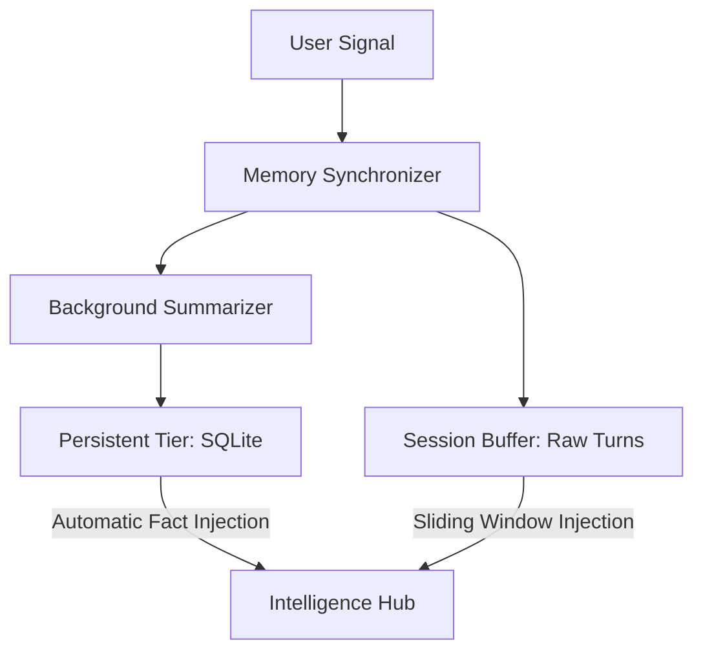

# OrionAgent
### The Sovereign Multi-Agent Orchestration Framework

<div align="center">

*An Industrially Robust, Minimalistic Multi-Agent System featuring Deterministic Persistence and Logic Validation*

<br />


<br />

**OrionAgent is built for performance. It eliminates the abstraction tax of modern agent frameworks, providing a low-latency, high-control environment for mission-critical AI applications.**

[Quick Start](#quick-start) &nbsp;&bull;&nbsp; [Core Configuration](#core-configuration--api-reference) &nbsp;&bull;&nbsp; [Architecture](#architecture-blueprints) &nbsp;&bull;&nbsp; [Memory Tier](#memory-architecture--patterns) &nbsp;&bull;&nbsp; [OrionAgent vs Others](#orionagent-vs-langchain--autogen)

---

</div>

## Overview

**OrionAgent** is a cutting-edge multi-agent orchestration framework designed to democratize professional-grade agentic workflows. Powered by the **Orion Engine**—a smart conversational core featuring **Multi-Provider LLM Support** (OpenAI, Gemini, Ollama) with **Deterministic Logic Guards**—OrionAgent offers real-time, actionable task execution for industrial-scale projects.

Whether you are building complex research swarms or precision-driven automation pipelines, the **Orion Agent** acts as your 24/7 technical companion, ensuring every output is validated, persistent, and token-efficient.

---

## Philosophy

OrionAgent is designed to eliminate the **black box** complexity of modern agent frameworks. It provides a low-abstraction, high-control environment for building agents that are **token-efficient**, **persistent by default**, and **deterministic** via logic guards.

---

## Installation

Install OrionAgent via pip for immediate industrial-grade orchestration:

```bash
pip install orionagent
```

---

## Quick Start

### Single Agent Integration
The `Agent` class provides a high-performance worker unit with integrated persistence and tool access.

```python
from orionagent import Agent, Gemini, tool

@tool
def crypto_ticker(symbol: str):
    """Fetches real-time prices for crypto assets."""
    return f"Current {symbol} Price: $65,000"

agent = Agent(
    name="Vanguard",
    role="Research Analyst",
    model=Gemini("gemini-2.0-flash"),
    memory="persistent",         # Automatic SQLite Knowledge Storage
    use_default_tools=True,      # Integrated Web, File, and OS tools
    tools=[crypto_ticker],
    guards=["straight", "short"], # Deterministic Output Validation
    verbose=True                 # Premium Dimmed Trace Logs
)

agent.chat("Analyze the current BTC trend.")
```

### Multi-Agent Orchestration
The `Manager` coordinates specialized agents through recursive strategy loops.

```python
from orionagent import Agent, Manager, Gemini

# 1. Define Model
llm = Gemini("gemini-2.0-flash")

# 2. Define Specialized Agents
researcher = Agent(
    name="Researcher",
    role="Technical Scraper",
    system_instruction="Focus on deep technical data sets.",
    use_default_tools=True
)

writer = Agent(
    name="Writer",
    role="Content Strategist",
    system_instruction="Synthesize complex data into premium reports.",
    guards=["straight", "long"]
)

# 3. Link via Manager
manager = Manager(
    model=llm,
    agents=[researcher, writer],
    strategy=["planning", "self_learn"] # Plan -> Execute -> Evaluate -> Correct
)

manager.chat("Draft a technical report on 2024 industrial AI trends.")
```


---

## Core Configuration & Architecture

OrionAgent utilizes a granular, declarative configuration system built for industrial-scale reliability. Below is a deep dive into the core execution variables that power the framework.

### 1. Deterministic Logic Guardrails
Guardrails act as a real-time auditor for agent outputs, ensuring every response adheres to mission-critical constraints.
- **`guards`**: A list of filters applied to the agent's response.
    - **`json`**: Forces the output into a valid JSON schema.
    - **`straight`**: Removes conversational filler and "fluff" for practical excellence.
    - **`polite`**: Ensures professional and courteous communication.
    - **`short` / `long`**: Controls output density for specific UI or bandwidth requirements.
- **`max_refinements`**: The maximum number of self-correction loops allowed. This prevents infinite loops while guaranteeing high-quality output (Default: `2`).

### 2. Multi-Tier Memory Systems
Persistence is a first-class citizen in OrionAgent. You can choose the persistence tier that fits your mission's longevity requirements.
- **`none`**: (Transient) No data is stored between turns. Ideal for privacy-first or stateless utility calls.
- **`session`**: (Short-Term) Retains raw conversation history in a structured sliding window for immediate precision.
- **`persistent`**: (Long-Term) Automatically distills and stores facts into a **Hierarchical SQLite** database, creating a growing knowledge base for the agent.

### 3. Strategic Orchestration (`strategy`)
The `Manager` employs recursive strategy loops to decompose and execute complex goals:
- **`planning`**: Decomposes a high-level goal into a deterministic array of parallelizable tasks, creating a clear execution roadmap.
- **`self_learn`**: The **Orion Verdict Loop**. If an agent produces an inadequate result or fails a guard, the Manager dynamically evaluates the failure and re-delegates with corrected context.

### 4. High-Performance Execution Engine NEW
OrionAgent is engineered for extreme efficiency, significantly reducing the "abstraction tax" of traditional frameworks:
- **Real-Time Streaming**: Enabled by default (`streaming=True`). All model providers support native chunk-level output for zero-latency UI responsiveness.
- **Concurrent Execution**: Orchestration strategies and tool execution now run in parallel by default (`async_mode=True`), verified to **reduce execution time by up to 60%** for complex tasks.
- **Built-in Observability**: Real-time, gray-highlighted debug logs (`verbose=True`) provide deep visibility into planning, tool usage, memory operations, and guard validations without cluttering production logs.
- **System-Level Persistence**: Utilizes native provider-side instructions to bake personas into the model's base state, verified to **reduce token usage by 30%**.
- **Autonomous Context Pruning**: Real-time monitoring of token counts, dynamically removing redundant history turns during long-running interactions.
- **Handoff Protocols**: Direct agent-to-agent delegation via `trigger_handoff()` to minimize Manager overhead for low-level tasks.


---

## Architecture Blueprints

Decoupled execution architecture for zero-latency orchestration.

```text
       ┌───────────────────────────────┐
       │      USER MISSION / GOAL      │
       └──────────────┬────────────────┘
                      │
              ┌───────▼───────┐        ┌──────────────────────────┐
              │    MANAGER    │◄──────▶│   STRATEGY ENGINE        │
              │ (Architect)   │        │ (Planning & Self-Learn)  │
              └───────┬───────┘        └──────────────────────────┘
                      │
              ┌───────▼───────┐        ┌──────────────────────────┐
              │    AGENT      │◄──────▶│    TOOL REGISTRY         │
              │ (Worker)      │        │ (AI-Authenticated Tools) │
              └───────┬───────┘        └──────────────────────────┘
                      │
              ┌───────▼───────┐        ┌──────────────────────────┐
              │ LOGIC GUARDS  │───────▶│    MEMORY CORE           │
              │ (Auditor)     │        │ (Hierarchical SQLite)    │
              └───────────────┘        └──────────────────────────┘
```

---

## Memory Architecture & Patterns

Managed through a **Dual-Tier Synchronizer**, OrionAgent maintains state across thousands of interactions without context saturation.

### Data Synchronization Flow


### State Storage Metrics
*   **Session Buffer**: Retains exact raw inputs for immediate task context.
*   **Knowledge Tier**: Distills large data volumes into concise **Knowledge Briefs**.
*   **Fact Isolation**: Multi-tenant data separation via `user_id` mapping.

---

---


## Framework Comparison

| Metric | OrionAgent | LangChain | AutoGen |
| :--- | :--- | :--- | :--- |
| **Abstraction** | **Minimalist** | Heavy | Moderate |
| **Logic Control** | **Deterministic Guards** | Custom Parsers | Limited |
| **Memory** | **Native SQLite Briefing** | Manual Pipeline | Basic Session |
| **Setup Cost** | **Zero-Config** | High Integration | Moderate |

---

## Contributing & Community

OrionAgent is an open ecosystem. We value contributions that maintain the framework's minimalistic core.

*   **Reporting Bugs**: Use the GitHub Issue Tracker.
*   **Feature Requests**: Open a Discussion thread for architectural review.
*   **Pull Requests**: Ensure all new tools follow the `@tool` schema validation protocol.

---

## Support & Roadmap

If you find OrionAgent valuable, consider starring the repository to support its development.

*   **Vitals Dashboard**: Real-time telemetry Web UI.
*   **Human-in-the-Loop**: Interactive approval gates for critical tool calls.
*   **Async Multi-Clusters**: Parallelized strategy execution across processes.

---

## License & Contact

<div align="center">

Released under the **MIT License**. Created by [Samir Lade](mailto:ladesamir10@gmail.com).

**OrionAgent: Build Agents That Actually Work.**

[GitHub](https://github.com/Sam-Dev-AI/OrionAgent) &nbsp;&bull;&nbsp; [PyPI](https://pypi.org/project/orionagent/) &nbsp;&bull;&nbsp; [Issue Tracker](https://github.com/Sam-Dev-AI/OrionAgent/issues)

</div>
