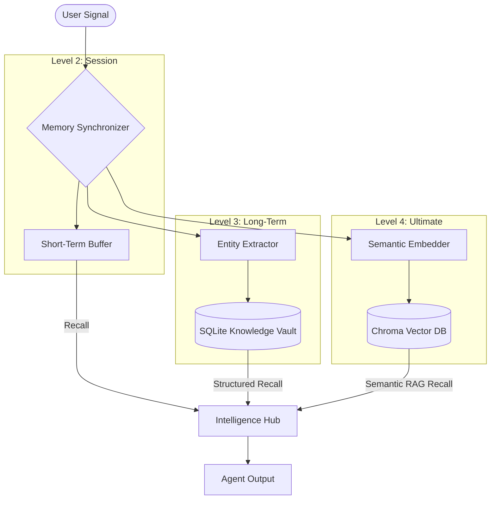

# OrionAgent
### The Sovereign Multi-Agent Orchestration Framework

<div align="center">

*An Industrially Robust, Minimalistic Multi-Agent System featuring Deterministic Persistence and Logic Validation*

<br />


<br />

**OrionAgent is built for performance. It eliminates the abstraction tax of modern agent frameworks, providing a low-latency, high-control environment for mission-critical AI applications.**

[Quick Start](#quick-start) &nbsp;&bull;&nbsp; [Master Skill Guide](SKILL.md) &nbsp;&bull;&nbsp; [Core Configuration](#core-configuration--api-reference) &nbsp;&bull;&nbsp; [Architecture](#architecture-blueprints) &nbsp;&bull;&nbsp; [Memory Tier](#memory-architecture--patterns) &nbsp;&bull;&nbsp; [OrionAgent vs Others](#orionagent-vs-langchain--autogen)

> [!TIP]
> **Attention Vibe Coders / AI Assistants**: For high-performance development, reference `SKILL.md` to master the framework's industrial patterns.

---

</div>

## Overview

**OrionAgent** is a cutting-edge multi-agent orchestration framework designed to democratize professional-grade agentic workflows. Powered by the **Orion Engine**—a smart conversational core featuring **Multi-Provider LLM Support** (OpenAI, Gemini, Anthropic, Ollama) with **Deterministic Logic Guards**—OrionAgent offers real-time, actionable task execution for industrial-scale projects.

Whether you are building complex research swarms or precision-driven automation pipelines, the **Orion Agent** acts as your 24/7 technical companion, ensuring every output is validated, persistent, and token-efficient.

---

## Philosophy

OrionAgent is designed to eliminate the **black box** complexity of modern agent frameworks. It provides a low-abstraction, high-control environment for building agents that are **token-efficient**, **persistent by default**, and **deterministic** via logic guards.

---

## Installation

Install OrionAgent via pip for immediate industrial-grade orchestration:

```bash
pip install orionagent
```

### Development Setup

If you are cloning the repository to run examples or contribute, install in **editable mode** to ensure all local resources are correctly mapped:

```bash
git clone https://github.com/Sam-Dev-AI/OrionAgent.git
cd OrionAgent
pip install -e .
```

---

## Quick Start

### Single Agent Integration
The `Agent` class provides a high-performance worker unit with integrated persistence and tool access.

```python
from orionagent import Agent, Gemini, tool

@tool
def crypto_ticker(symbol: str):
    """Fetches real-time prices for crypto assets."""
    return f"Current {symbol} Price: $65,000"

agent = Agent(
    name="Vanguard",
    role="Research Analyst",
    model=Gemini("gemini-2.0-flash"),
    memory="long_term",          # Automatic SQLite Knowledge Storage
    use_default_tools=True,      # Integrated Web, File, and OS tools
    tools=[crypto_ticker],
    guards=["straight", "short"], # Deterministic Output Validation
    temperature=0.7,             # Model Creativity Control
    verbose=True                 # Premium Dimmed Trace Logs
)

agent.chat("Analyze the current BTC trend.")
```

### Multi-Agent Orchestration
The `Manager` coordinates specialized agents through recursive strategy loops.

```python
from orionagent import Agent, Manager, Gemini

# 1. Define Model
llm = Gemini("gemini-2.0-flash")

# 2. Define Specialized Agents
researcher = Agent(
    name="Researcher",
    role="Technical Scraper",
    system_instruction="Focus on deep technical data sets.",
    use_default_tools=True
)

writer = Agent(
    name="Writer",
    role="Content Strategist",
    system_instruction="Synthesize complex data into premium reports.",
    guards=["straight", "long"]
)

# 3. Link via Manager
manager = Manager(
    model=llm,
    agents=[researcher, writer],
    strategy=["planning", "self_learn"], # Plan -> Execute -> Evaluate -> Correct
    temperature=0.3                      # Global override for orchestration
)

manager.chat("Draft a technical report on 2024 industrial AI trends.")
```


---

## Core Configuration & Architecture

OrionAgent utilizes a granular, declarative configuration system built for industrial-scale reliability. Below is a deep dive into the core execution variables that power the framework.

### 1. Deterministic Logic Guardrails
Guardrails act as a real-time auditor for agent outputs. They are applied as a declarative list of strings or custom functions.

```python
agent = Agent(
    guards=["straight", "short", "json"], # Apply specific validators
    max_refinements=3                     # Max attempts for self-correction
)
```
- **`json`**: Forces output into a valid JSON schema.
- **`straight`**: Removes "fluff" (e.g. "I hope this helps") and emojis.
- **`short` / `long`**: Strictly controls the sentence count/density.

### 2. Memory Levels (`memory`)
OrionAgent uses a **Tiered Logic Engine** to scale context. Select your ecosystem power level:

| Level | Mode | Behavior | Power |
| :--- | :--- | :--- | :--- |
| **1** | `none` | No memory. Static responses only. | Static |
| **2** | `session` | Fast temporary conversation buffer. | Medium |
| **3** | `long_term`| Session + Persistent SQLite (Fact Recall). | High |
| **4** | `chroma` | **Session + SQLite + Vector Knowledge (Semantic RAG).**| **Ultimate** |

```python
# Initialize an agent with the 'Ultimate' level
from orionagent import Agent
agent = Agent(memory="chroma")

# Advanced configuration
from orionagent import MemoryConfig
agent = Agent(
    memory=MemoryConfig(
        mode="chroma",
        priority="high",            # Depth: 'low', 'medium', or 'high'
        extract_entities=True,      # Enable Knowledge Extraction
        importance_threshold=7      # Sync threshold (1-10)
    )
)
```

- **Semantic Memory (Chroma)**: Level 4 allows for industrial-scale knowledge persistence using vector embeddings, enabling high-quality RAG.
- **Structured Knowledge Vault**: Automatically extracts facts (Names, Roles, Decisions) into a JSON schema, ensuring 100% accuracy.
- **Priority Tiers**: Control how deep the extraction goes with `low` (token-saving), `medium` (balanced), and `high` (exhaustive) tiers.


### 3. Strategic Orchestration (`strategy`)
The `Manager` employs recursive strategy loops to decompose and execute complex goals.

```python
manager = Manager(
    agents=[researcher, analyst],
    strategy=["planning", "self_learn"], # Chain multiple strategies
    max_refinements=2,                   # Self-correction limit
    hitl=True                            # Enable Human-in-the-Loop Safety gate
)
```
- **`planning`**: Decomposes a goal into a roadmap of parallel tasks.
- **`self_learn`**: Executes the **Verdict Loop**—evaluating results and re-delegating with corrected context if quality fails.
- **`hitl` (Safety Gate)**: When `True`, the Manager pauses for terminal approval `(y/n)`. 

**Granular Safety Levels:**
```python
from orionagent import HitlConfig
manager = Manager(
    agents=[...],
    hitl=HitlConfig(
        permission_level="medium", # Ask only for risky tasks (delete, shell, etc.)
        ask_once=True,             # Single approval for complex plans
        plan_review=True           # Show full task breakdown
    )
)
```
| Level | Behavior |
| :--- | :--- |
| `low` | Always asks for approval (Default if hitl=True). |
| `medium` | Asks only for high-impact actions (Risk-based). |
| `high` | Complete autonomy (Default if hitl=False). |

### 4. High-Performance Execution Engine
OrionAgent is engineered for zero-latency. Control core performance variables directly:

```python
# 1. Enable token usage tracking and set default temperature
llm = Gemini(model_name="gemini-2.0-flash", token_count=True, temperature=0.7)

# 2. Control execution speed and streaming
agent = Agent(
    model=llm,
    async_mode=True, # Enable parallel tool calls & strategy steps
    temperature=0.3, # Override model default for this specific agent
    debug=True       # Real-time 'Industrial' reasoning logs
)

# 3. Request-level override
agent.ask("What is the speed of light?", temperature=0.0)
```

- **`token_count=True`**: Tracks input/output tokens for precise cost monitoring.
- **`async_mode=True`**: Executes independent tasks in parallel (up to 60% faster).
- **`debug=True`**: Enables live `[PLAN]`, `[TOOL]`, `[GUARD]` tags in terminal.

---

## Detailed Performance Usage

### Professional Logging & Observability
OrionAgent offers two tiers of visibility:
1.  **`debug=True`**: Real-time "Industrial" logs (tags like `[TOOL]`, `[PLAN]`). Use this to watch agents think and work live.
2.  **`verbose=True`**: Post-execution "Trace Summary". Use this for clean, professional reports of what happened and how long it took.

```python
# Enable 'Industrial' real-time logs + 'Trace' summary
llm = Gemini(model_name="gemini-2.0-flash", debug=True, verbose=True)

# Or enable per-component for granular control
manager = Manager(model=llm, debug=True)
agent = Agent(name="Sentry", debug=True)
```

### Concurrent Orchestration
OrionAgent leverages parallel orchestration to maximize throughput. When `async_mode` is active, the Manager executes independent task groups simultaneously.

```python
# Explicitly control concurrency (Default: True)
manager = Manager(
    agents=[researcher, coder],
    async_mode=True 
)
```

- **Parallel Tooling**: If an agent needs to call 3 tools (e.g., searching 3 different sources), it will execute them in parallel, returning the results in the time of the single slowest call.
- **Parallel Strategy**: The `planning` strategy automatically groups tasks that don't depend on each other for simultaneous execution.

---

### 5. System-Level Token Optimization
OrionAgent minimizes operational overhead by pruning unnecessary context and optimizing prompt density:

- **Sliding Window Session Memory**: Automatically manages conversation history to prevent context window saturation and rising latency.
- **Structured Entity Summarization**: Replaces heavy text summaries with lean, categorized fact lists, reducing per-turn token usage by up to 85%.
- **Hierarchical Knowledge Sync**: Instead of feeding raw history, the `long_term` tier distills facts into an optimized SQLite DB, ensuring only relevant data is injected into the prompt.
- **Priority-Driven Summarizer**: Use `low` priority for casual chats to save tokens with minimalist one-sentence summaries.
- **Compact Planning Prompt**: The `Strategy` engine uses a specialized, ultra-lean prompt (~100 tokens) to decompose tasks, ensuring that the heavy lifting is done with minimal structural baggage.
- **Precision Tool Routing**: Agents only receive the context relevant to the specific step they are executing, preventing "prompt pollution" from unrelated task phases.


---

## Architecture Blueprints

Decoupled execution architecture for zero-latency orchestration.

```text
       ┌───────────────────────────────┐
       │      USER MISSION / GOAL      │
       └──────────────┬────────────────┘
                      │
              ┌───────▼───────┐        ┌──────────────────────────┐
              │    MANAGER    │◄──────▶│   STRATEGY ENGINE        │
              │ (Architect)   │        │ (Planning & Self-Learn)  │
              └───────┬───────┘        └──────────────────────────┘
                      │
              ┌───────▼───────┐        ┌──────────────────────────┐
              │    AGENT      │◄──────▶│    TOOL REGISTRY         │
              │ (Worker)      │        │ (AI-Authenticated Tools) │
              └───────┬───────┘        └──────────────────────────┘
                      │
              ┌───────▼───────┐        ┌──────────────────────────┐
              │ LOGIC GUARDS  │───────▶│    MEMORY CORE           │
              │ (Auditor)     │        │ (Hierarchical SQLite)    │
              └───────────────┘        └──────────────────────────┘
```

---

## Memory Architecture & Patterns

Managed through a **Dual-Tier Synchronizer**, OrionAgent maintains state across thousands of interactions without context saturation.

### Data Synchronization Flow (The Memory Engine)


### State Storage Metrics
*   **Session Buffer**: Retains exact raw inputs for immediate task context.
*   **Knowledge Tier**: Distills large data volumes into concise **Knowledge Briefs**.
*   **Fact Isolation**: Multi-tenant data separation via `user_id` mapping.

---

---


## Framework Comparison

| Metric | OrionAgent | LangChain | AutoGen |
| :--- | :--- | :--- | :--- |
| **Abstraction** | **Minimalist** | Heavy | Moderate |
| **Logic Control** | **Deterministic Guards** | Custom Parsers | Limited |
| **Memory** | **Native SQLite Briefing** | Manual Pipeline | Basic Session |
| **Setup Cost** | **Zero-Config** | High Integration | Moderate |

---

## Contributing & Community

OrionAgent is an open ecosystem. We value contributions that maintain the framework's minimalistic core.

*   **Reporting Bugs**: Use the GitHub Issue Tracker.
*   **Feature Requests**: Open a Discussion thread for architectural review.
*   **Pull Requests**: Ensure all new tools follow the `@tool` schema validation protocol.

---

## Support & Roadmap

If you find OrionAgent valuable, consider starring the repository to support its development.

*   **Vitals Dashboard**: Real-time telemetry Web UI.
*   **Human-in-the-Loop**: Interactive approval gates for critical tool calls.
*   **Async Multi-Clusters**: Parallelized strategy execution across processes.

---

## License & Contact

<div align="center">

Released under the **MIT License**. Created by [Samir Lade](mailto:ladesamir10@gmail.com).

**OrionAgent: Build Agents That Actually Work.**

[GitHub](https://github.com/Sam-Dev-AI/OrionAgent) &nbsp;&bull;&nbsp; [PyPI](https://pypi.org/project/orionagent/) &nbsp;&bull;&nbsp; [Issue Tracker](https://github.com/Sam-Dev-AI/OrionAgent/issues)

</div>
