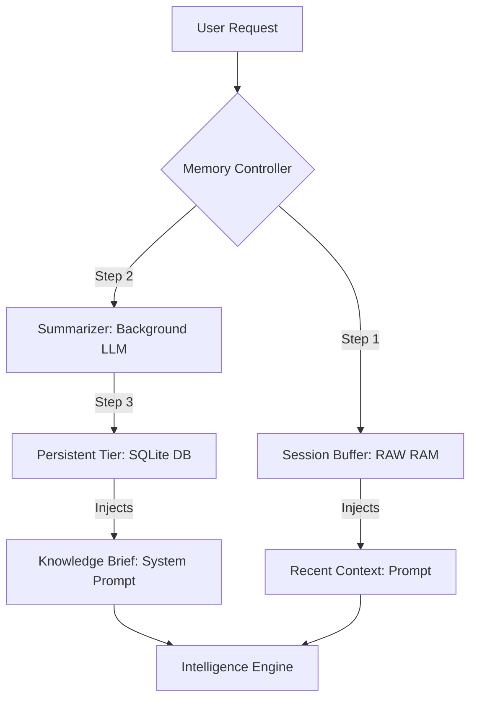

# OrionAI

<div align="center">

**A minimalistic yet industrially robust multi-agent orchestration framework. Precision-engineered for memory persistence, logic validation, and autonomous self-correction.**

[](https://pypi.org/project/orionagent/)
[](https://www.python.org/downloads/)
[](https://opensource.org/licenses/MIT)

[Quick Start](#quick-start) • [Core Configuration](#core-configuration--api-reference) • [Architecture](#architecture-blueprints) • [Memory Tier](#memory-architecture--patterns) • [OrionAI vs Others](#orionagent-vs-langchain--autogen)

</div>

---

## Why OrionAI?

OrionAI is designed to eliminate the "black box" complexity of modern agent frameworks. It provides a low-abstraction, high-control environment for building agents that are **token-efficient**, **persistent by default**, and **deterministic via logic guards**.

---

## Quick Start

### 10-Second Example: Single Agent Power
```python
from orionagent import Agent, Gemini, tool

@tool
def crypto_ticker(symbol: str):
    """Fetches real-time prices for crypto assets."""
    return f"Current {symbol} Price: $65,000 (Mock)"

agent = Agent(
    name="Vanguard",
    role="Research Analyst",
    model=Gemini("gemini-2.0-flash"),
    memory="persistent",       # Saves state to SQLite automatically
    use_default_tools=True,    # Web Search, File, Terminal access
    tools=[crypto_ticker],
    guards=["straight", "short"] # Enforces professional tone and brevity
)

agent.chat("What is the current BTC price and summarize its impact?")
```

### Multi-Agent Showcase: Autonomous Delegation
```python
from orionagent import Agent, Manager, Gemini

manager = Manager(
    model=Gemini("gemini-2.0-flash"),
    agents=[
        Agent(name="Researcher", role="Technical Scraper", use_default_tools=True),
        Agent(name="Writer", role="Content Strategist", guards=["happy", "long"])
    ],
    strategy=["planning", "self_learn"] # Plan first, then evaluate results
)

manager.chat("Research the latest 2024 AI trends and write a 500-word blog post.")
```

---

## Core Configuration & API Reference

OrionAI is configured through explicit parameters to ensure deterministic behavior.

### 1. Agent Logic & Guards
* **guards** *(List[str])*: Enforces output constraints.
    * `json`: Forces the model to return valid JSON.
    * `straight`: Removes emojis and informal fluff.
    * `short` / `long`: Constrains response length.
    * `polite` / `happy`: Sets a specific emotional tone.
* **verbose** *(bool)*: Enables the "Aesthetic Debugger" showing real-time tool calls, token usage, and strategy reasoning in the terminal.
* **use_default_tools** *(bool)*: Instantly injects five industrial tools: Google Search, Terminal, Python Sandbox, File Manager, and System Info.

### 2. Tools & Customization
* **@tool** *(Decorator)*: Converts any standard Python function into a schema-validated agent tool.
* **memory** *(str)*: Defines the state pipeline.
    * `none`: No history retention.
    * `session`: Short-term RAM-based history.
    * `persistent`: Long-term SQLite knowledge with summarization.

### 3. Manager & Orchestration
* **strategy** *(str or List)*:
    * `planning`: Decomposes tasks into a sequential checklist.
    * `self_learn`: The "Verdict" mode. Evaluates agent output and re-delegates if quality is insufficient.
    * `["planning", "self_learn"]`: The ultimate mode—plans the work and then audits every single step for accuracy.

---

## Architecture Blueprints

The framework is built on a decoupled architecture that separates intent from execution.

```text
[ USER MISSION ] 
      │
      ▼
┌───────────────────┐      ┌──────────────────────────┐
│ MANAGER           │◄────▶│ STRATEGY ENGINE          │ (Combined Plan + Learn)
│ (The Architect)   │      └──────────────────────────┘
└─────────┬─────────┘
          │ (Distributes Tasks)
          ▼
┌───────────────────┐      ┌─────────────────────────┐
│ AGENT             │◄────▶│ TOOL REGISTRY           │ (AI Native Executables)
│ (The Executor)    │      └─────────────────────────┘
└─────────┬─────────┘
          │ (Validation Phase)
          ▼
┌───────────────────┐      ┌──────────────────────────┐
│ LOGIC GUARDS      │─────▶│ MEMORY SYNCHRONIZER      │ (Real-time Context Prep)
│ (The Auditor)     │      └──────────────────────────┘
└───────────────────┘
```

---

## Memory Architecture & Patterns

OrionAI uses a "Dual-Tier Pipeline" to manage massive context histories efficiently.

### Memory Configuration Diagram


### Memory Examples

| Tier | Example Content Stored | Retention |
| :--- | :--- | :--- |
| **Session** | "What is the capital of France?" -> "Paris" | Deleted after task end. |
| **Persistent** | "User prefers BTC news over ETH" | Stored in `orionagent.db` permanently. |
| **Briefing** | "Yesterday's research concluded that ROI is 15%." | Injected as a single fact. |

---

## Token Efficiency & Performance

1. **Native System Instructions**: Uses provider system roles to avoid re-billing system instructions on every turn.
2. **Context Pruning**: Old messages are distilled into metadata, preventing context-limit errors.
3. **Manager Weight**: The orchestrator is ultra-light, adding <5ms latency to model responses.

---

## OrionAI vs LangChain & AutoGen

| Feature | OrionAI | LangChain | AutoGen |
| :--- | :--- | :--- | :--- |
| **Philosophy** | Zero-Magic / Explicit | Abstraction-Heavy | Conversational Swarm |
| **Logic Validation** | Built-in Guards | Needs custom Parsers | Limited control |
| **Memory** | Native SQLite Auto-Brief | Manual wiring | Basic persistence |

---

## Roadmap
- **Observability Dashboard**: Local Web UI for real-time trace visualization.
- **Human-in-the-Loop**: Pause points for dangerous tool calls.
- **Async Clusters**: True multi-process parallel execution.

---

## License & Contact
Released under the **MIT License**. Created by Samir Lade.

<div align="center">

**OrionAI: Build Agents That Actually Work.**

</div>
